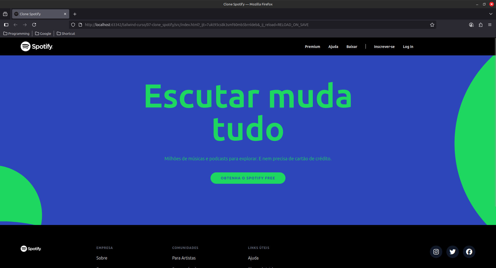
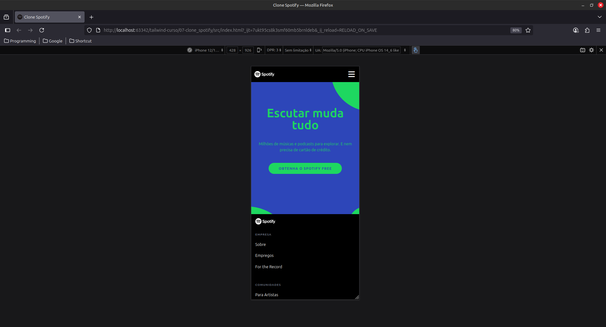
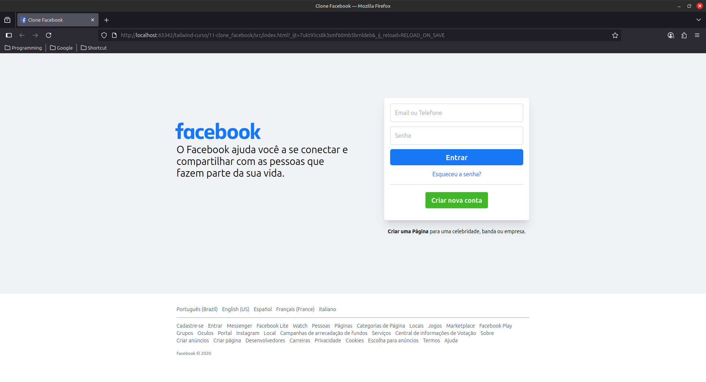
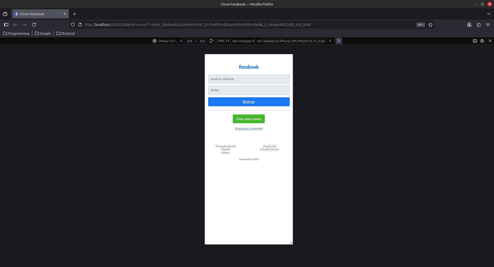
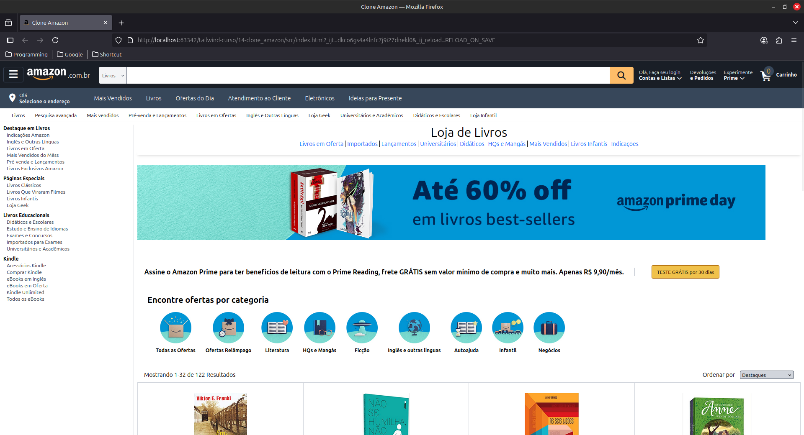
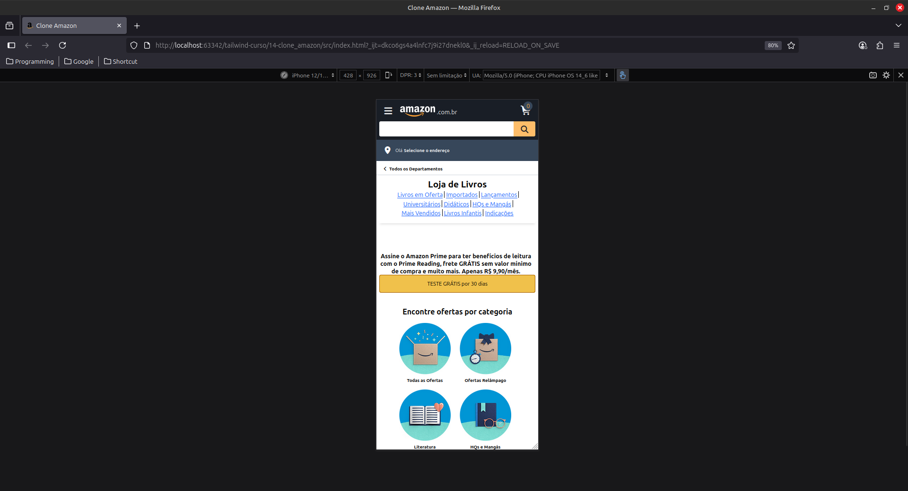

# 🎨 Projetos com TailwindCSS

Este repositório contém 3 projetos desenvolvidos com **TailwindCSS**, feitos para praticar e explorar os recursos do framework.
Os projetos foram desenvolvidos durante um curso de TailwindCSS.

---

## 📌 Projetos

### 1️⃣ Projeto 1 – Clone Spotify

<p align="center"> 
<p align="center"> 
  
---

### 2️⃣ Projeto 2 – Clone Facebook

<p align="center"> 
<p align="center"> 

---

### 3️⃣ Projeto 3 – Clone Amazon

<p align="center"> 
<p align="center"> 

---

## 🛠 Tecnologias

- HTML5
- CSS3
- [TailwindCSS](https://tailwindcss.com/)

---

## 🚀 Como visualizar
Você pode abrir os projetos direto no navegador:  

1. Clone o repositório:
   
   ```
   git clone https://github.com/AlissonSimon/curso-tailwind.git
   ```
